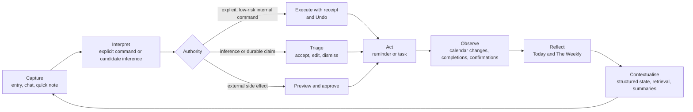
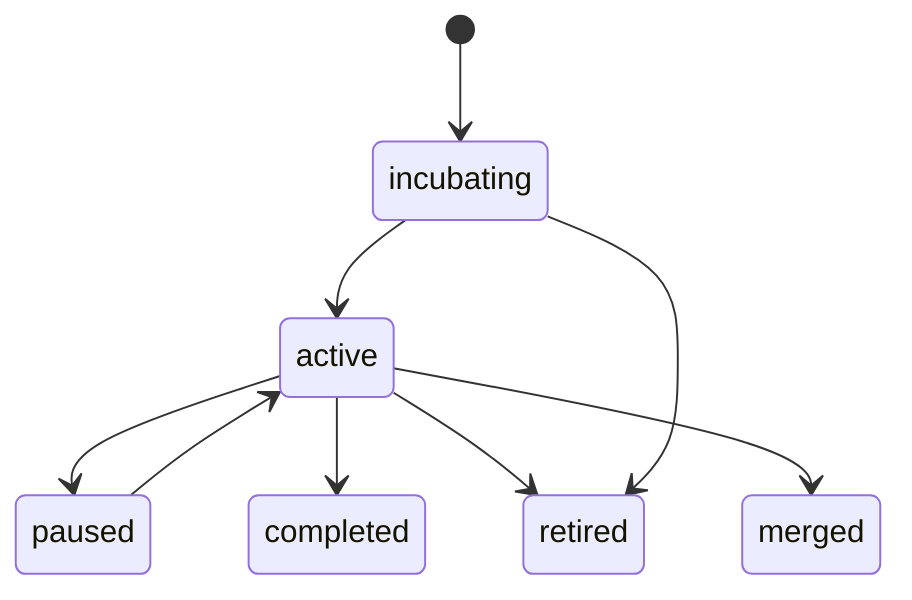
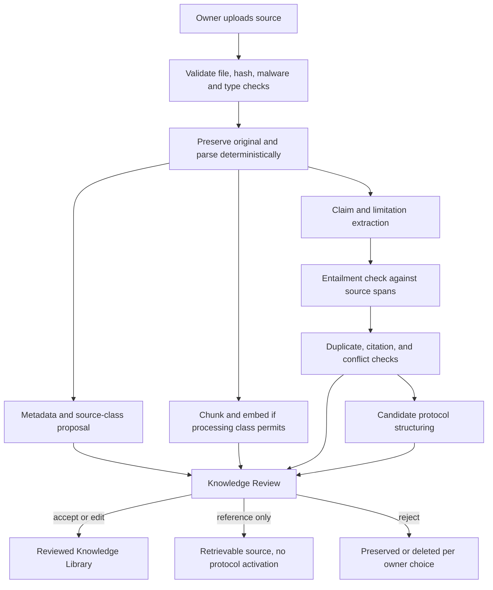
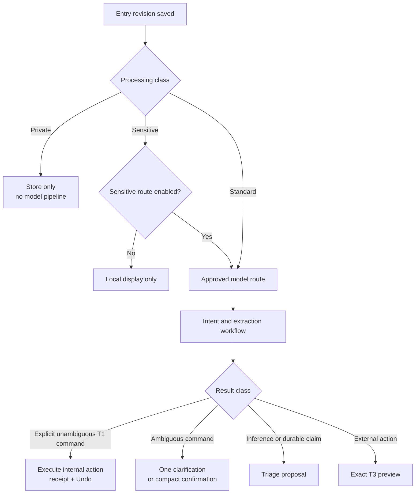
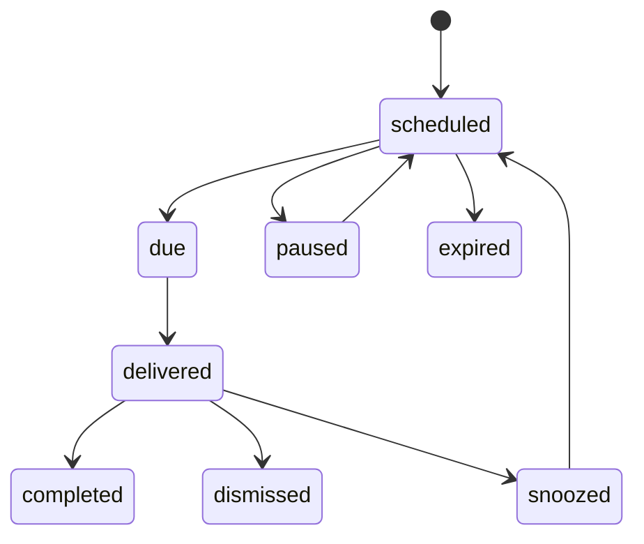
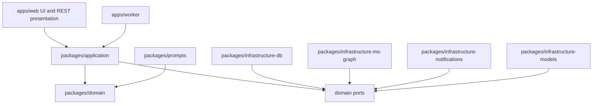

# Meridian — Design Specification v1.2

**A personal diary that keeps its promises.**

| Field | Value |
|---|---|
| Version | 1.2 |
| Date | 18 July 2026 |
| Status | Foundational product and implementation specification |
| Initial deployment | Single-owner personal web application |
| Primary calendar | Microsoft Outlook through Microsoft Graph |
| Audience | Owner-user, Codex and other coding agents, future contributors |
| Supersedes | Meridian Design Specification v1.1 |

---

## 1. How to read and govern this document

This document is both a product specification and an implementation blueprint. It is deliberately opinionated, but it separates confirmed product requirements from recommendations and experiments.

Tags used throughout:

- **[REQ]** — confirmed requirement or correctness, safety, privacy, or trust invariant.
- **[REC]** — recommended default; may be changed with recorded evidence.
- **[ASM]** — assumption to validate through personal use or a technical spike.
- **[EXP]** — experiment; do not ship as a normal capability until its gate is met.
- **[DEF]** — deferred; preserve a clean boundary but do not implement yet.
- **[REJ]** — rejected for Meridian unless the product specification is deliberately changed.

### 1.1 Authority hierarchy [REQ]

No document may silently override another document outside its authority.

1. **Product requirements and release scope:** `docs/product/spec.md` and accepted Product Decision Records (PDRs).
2. **Architecture:** accepted ADRs. An ADR may implement a product requirement differently, but may not remove or weaken it.
3. **Domain schemas:** versioned schemas in `packages/domain`, with generated data documentation.
4. **Application API:** the canonical OpenAPI contract generated from versioned request and response schemas.
5. **Domain events:** versioned event schemas and the event catalogue.
6. **Calendar behaviour:** `docs/integrations/microsoft-calendar.md` plus its contract tests.
7. **Reminder behaviour:** `docs/domain/reminders.md` plus its state-machine and delivery tests.
8. **Prompts:** versioned prompt packages and their evaluation results.
9. **Active model choices:** the date-stamped model registry.
10. **Roadmap and current implementation state:** `docs/product/roadmap.md` and the project-state file.

Generated documentation reports source definitions; it does not independently create requirements. Conflicts fail `docs:check` and must be resolved through a PDR or ADR before merge.

### 1.2 Revision summary

Version 1.2 preserves the v1.1 product, trust, calendar, reminder, privacy, and implementation architecture. It adds a governed external-knowledge and protocol layer so uploaded health, productivity, behavioural, and research material can be preserved, represented semantically, converted into inspectable claims and protocol candidates, and used cautiously in later planning and advice. External knowledge remains distinct from evidence about the owner.

| Review concern | Decision | v1.2 response |
|---|---|---|
| The original MVP was too large | Accepted | Split into Personal Alpha, Personal Beta, Personal v1, and later research phases |
| Explicit commands should not require a second Triage visit | Accepted | Added a direct-command tier with inline receipt, Edit, and Undo |
| Calendar time is not evidence that work occurred | Accepted | Added an execution-evidence hierarchy and changed analytics to planned versus confirmed |
| Provenance should not rely only on JSONB arrays | Accepted | Added a resource registry and normalised derivation links |
| Diary entries must be editable | Accepted | Added immutable entry revisions under a stable entry identity |
| Domain-to-database dependency direction was wrong | Accepted | Added explicit application layer and infrastructure adapters implementing domain ports |
| Maintaining tRPC and REST is unnecessary | Accepted | OpenAPI REST is the single canonical application API |
| Calendar-view delta windows do not roll automatically | Accepted | Added versioned overlapping sync windows and cursor rotation |
| Microsoft To Do should be tested before building delivery infrastructure | Accepted | Added an early time-boxed To Do delivery spike and decision gate |
| Email and in-app reminders may be too weak | Accepted | Reminder delivery is decided through the spike; in-app is never the sole urgent channel |
| Model defaults become stale | Accepted | Named models are candidates, while a Meridian-specific bake-off is authoritative |
| Sensitive classification after external disclosure is circular | Accepted | Added user-selected processing classes and local pre-screening before remote calls |
| Composite Pulse is pseudo-precise | Accepted | No Pulse in Alpha; transparent components in Beta; optional Activity Pulse in v1 |
| First Codex prompt was too broad | Accepted | Replaced it with small, bounded work packages and five initial prompts |
| Event-table partitioning was premature | Accepted | Removed; partition only after measured need |
| Numbering and supersession rules were unclear | Accepted | Clean sequential sections and precise authority rules |
| Five active goals should be a hard invariant | Partly accepted | Five is a soft default and planning warning, not a schema constraint |
| Microsoft login should not be the only route to the diary | Accepted | Local owner authentication is separate from Microsoft integration |
| Existing Outlook events need an adoption model | Accepted | Added explicit reversible adoption with instance or series scope |
| Health and productivity research should inform future advice | Accepted | Added a user-initiated Knowledge Library, source and claim provenance, protocol review, evidence grading, semantic retrieval, adoption tracking, and health-safety gates |

---

# Part I — Product

## 2. Product definition

### 2.1 What Meridian is

**Meridian is a single-owner intelligent diary that converts natural reflection into trustworthy memory, realistic action, and progressively better personal context.**

The user writes or speaks naturally about plans, commitments, worries, ideas, progress, decisions, setbacks, routines, and goals. Meridian preserves the source material, selectively proposes structure, helps place approved intentions into time, records what is actually confirmed to have happened, and uses that evidence to improve future retrieval, planning, and reflection.

The product thesis is:

> **A diary in, a slightly better week out — repeatably, for years.**

Meridian combines only the minimum portions of a diary, task system, reminder service, calendar assistant, personal knowledge graph, external evidence library, protocol system, and analytics platform needed to close one coherent loop.

### 2.2 What Meridian is not [REQ]

Meridian is not:

- A therapist or diagnostic system.
- A universal score of the user's life.
- A full replacement for Outlook or Microsoft To Do.
- A general project-management suite.
- An autonomous system that reorganises the user's calendar.
- A system that silently turns speculative model output into personal truth.
- A social product, team product, marketplace, or enterprise platform.
- A reason to instrument every human experience.

### 2.3 Central value loop [REQ]



The system grows through user-authorised evidence. It does not grow merely because a model generated text.

### 2.4 Product principles [REQ]

1. **Source first, structure second.** Entry revisions are immutable evidence; derived structure is replaceable.
2. **Explicit intent counts.** Clear low-risk commands should execute without bureaucratic re-confirmation, while remaining reversible and audited.
3. **Inference must earn durability.** Inferred goals, memories, metrics, and relationships pass through Triage.
4. **External effects require preview.** Calendar writes, task export, event adoption, destructive operations, and reminder escalation require exact approval.
5. **Provenance or it did not happen.** Every derived claim links to its source revision and, where possible, source span.
6. **Calendar presence is not execution.** Analytics distinguish planned, elapsed, confirmed, unknown, and explicitly not completed.
7. **Numbers come from code.** Models may interpret registered calculations but may not invent statistics, dates, probabilities, or conflicts.
8. **Silence is a feature.** Meridian has quiet hours, attention budgets, digest modes, and graceful recovery after absence.
9. **Uncertainty is visible.** “Not enough reliable evidence” is a valid and designed result.
10. **The owner controls processing.** Privacy class is chosen before external model processing; private entries never leave Meridian.
11. **Boring foundations, adaptive edges.** Storage and contracts are stable; prompts, models, metrics, and analytics are versioned layers designed to change.
12. **One person first, clean ownership always.** The initial product is personal, while every user-owned resource is scoped from day one.
13. **External knowledge is not personal truth.** Uploaded research, expert commentary, and protocol material remain source-linked external evidence. They may guide questions and proposals but do not become facts about the owner, prove causality, or override health and safety constraints.
14. **Advice must show its basis.** Material recommendations distinguish personal evidence, external evidence, assumptions, and uncertainty, with citations or source links available in one interaction.

## 3. Release boundaries

The architecture preserves the long-term vision, but usefulness must arrive early.

### 3.1 Personal Alpha [REQ]

**Purpose:** provide reliable daily value before advanced memory or analytics exist.

Scope:

- Local owner authentication independent of Microsoft OAuth.
- Microsoft account connection for Outlook calendar read access.
- Versioned text journal entries with Standard, Sensitive, and Private processing classes.
- Quick capture and mobile-responsive capture.
- Explicit task and reminder commands with inline interpretation, Edit, and Undo.
- Triage for inferred tasks, commitments, goals, memories, and reminder suggestions.
- A thin internal task model.
- A reminder-delivery route selected through the Microsoft To Do spike.
- A basic Today view containing the Outlook agenda, due tasks, reminders, and at most three chosen priorities.
- Activity ledger, consent ledger, and fundamental provenance.
- No embeddings, Pulse, predictive analytics, or autonomous planning.

Exit criteria:

- The owner can capture an entry, issue a reminder, receive it on a dependable device channel, complete or dismiss it, and see the full audit chain.
- Outlook read synchronisation survives token refresh, fixed-window cursor rotation, recurrence, and time-zone fixtures.
- Private entries are proven not to reach model, embedding, summary, analytics, or logging paths.
- The owner can use Alpha for two weeks without needing developer intervention for ordinary use.

### 3.2 Personal Beta [REQ]

**Purpose:** close the diary-to-planning-to-confirmed-execution loop.

Adds:

- Goals, goal-linked tasks, dependencies, and soft active-goal guidance.
- Deterministic availability and block proposal.
- Exact approval of app-managed Outlook blocks.
- Explicit adoption and release of existing Outlook events.
- Low-friction post-block execution confirmation.
- Planned-versus-confirmed reporting.
- Basic weekly review.
- Semantic retrieval for Standard entries and any Sensitive entries explicitly allowed for the selected provider.
- Inspectable context manifests.
- A user-initiated Knowledge Library for PDF, Markdown, text, and supported document uploads.
- Original-file preservation, immutable source revisions, extracted text, source metadata, chunks, and privacy-eligible embeddings.
- Candidate external claims and health/productivity protocol structures reviewed before activation.
- Transparent trend components rather than a composite Pulse.
- Basic manual metrics.

Exit criteria:

- The owner can define a goal, schedule work around real commitments, confirm what occurred, and review the difference between plans and confirmed execution.
- Retrieval can surface relevant prior episodes with source links and privacy filtering.
- An uploaded research source can be retrieved semantically, cited at the source-span level, and produce protocol candidates whose claims remain traceable to the source.
- No uploaded source silently becomes an active protocol or personalised health recommendation.
- No displayed goal-progress signal gives credit solely because a calendar event elapsed.

### 3.3 Personal v1 [REQ]

**Purpose:** deliver the complete trustworthy longitudinal assistant.

Adds, subject to evidence:

- Day, week, goal, and period summaries.
- Mature memory manager and derivation inspection.
- User-defined and AI-proposed metric definitions.
- Short- and long-term trends.
- Optional per-goal Activity Pulse after sufficient confirmed execution evidence.
- Five-component decision-focused dashboard.
- Evidence-linked recommendations.
- Adaptive analytics registry with reviewed deterministic calculations.
- Export, verified hard deletion, backup and restore drills.
- Reminder-fatigue and repeated-postponement analysis.
- Relationship-network view if the underlying edge data proves useful.
- A governed Protocol Library for health, productivity, learning, recovery, focus, sleep, and other owner-approved domains.
- Protocol adoption as a versioned personal plan or experiment with burden, adherence, outcome, adverse-response, and discontinuation tracking.
- Recommendations that combine personal context with eligible external evidence and expose both evidence lanes separately.
- Conflict and duplicate detection across protocol claims, with an explicit unresolved-conflict state.

### 3.4 Later and experimental [DEF/EXP]

- Voice capture and transcription.
- Offline PWA drafts.
- Semantic clustering and theme emergence.
- Personal experiments and decision retrospectives.
- Local models for sensitive classification or embeddings.
- User-initiated Outlook email import.
- OneDrive encrypted export target.
- Second calendar provider.
- Native mobile application.
- Goal-completion forecasting after sufficient completed-goal history.
- Multi-user production hardening.
- DOI, URL, and reference-list assisted source import.
- Retraction, correction, and source-update monitoring where reliable external metadata is available.
- Cross-source evidence synthesis, systematic-review assistance, and citation-network exploration after source-quality evaluation.
- Local document parsing, OCR, and embeddings for highly sensitive knowledge collections if operationally justified.

### 3.5 Explicitly rejected [REJ]

- Mailbox surveillance.
- Autonomous modification or deletion of user-owned calendar events.
- Silent reminder escalation.
- Universal life score, badges, or streak punishment.
- Psychological or medical diagnosis.
- Generated analytics code executed without review.
- Agent swarms.
- Premature microservices or separate graph, vector, and time-series databases.
- Treating an influencer, podcast, paper, book, or uploaded document as automatically authoritative.
- Activating health protocols directly from extracted text without evidence review, applicability checks, and owner approval.
- Presenting educational protocol guidance as diagnosis, treatment, or a substitute for qualified clinical care.

## 4. Core journeys

### 4.1 Morning orientation

In under 90 seconds the owner sees:

- Fixed Outlook commitments.
- Meridian blocks.
- Due tasks and dependable reminders.
- At most three chosen priorities.
- At most two deterministic risks, such as a deadline-capacity shortfall.

### 4.2 Explicit command

The owner writes: “Remind me tomorrow at 15:00 to email Margaret.” Meridian resolves the instant deterministically, displays a compact receipt, creates the internal reminder, and offers Edit and Undo. It does not require a separate Triage visit.

### 4.3 Inferred commitment

The owner writes: “I really ought to email Margaret sometime.” Meridian may propose a task or reminder in Triage. It may not create either automatically.

### 4.4 Calendar-aware planning

The owner asks for three hours before Friday. Meridian synchronises the relevant Outlook window, calculates availability and buffers deterministically, and presents exact proposed blocks. No events are created until approved.

### 4.5 Post-block confirmation

After a Meridian block, the owner can answer with one tap:

- Done as planned.
- Partly done.
- Not done.
- Rescheduled.
- Skip this check.

The elapsed block alone remains `unknown_execution`.

### 4.6 The Weekly

The review compares:

- Planned time.
- Confirmed execution.
- Unknown elapsed blocks.
- Completed tasks and milestones.
- Repeated postponements.
- Reminder responses.
- Short- and long-term component trends.
- Open Triage proposals.
- One to three evidence-linked observations.

### 4.7 Deep recall

A later question retrieves relevant structured state, summaries, personal source revisions, and eligible external knowledge. Claims are linked to the evidence used, and sparse or conflicting evidence is stated openly.

### 4.8 Research-to-protocol ingestion

The owner uploads a paper, report, chapter, transcript, or protocol document—for example, material discussing a sleep, focus, exercise, recovery, or productivity practice. Meridian:

1. Preserves the original file and creates an immutable source revision.
2. Extracts and normalises text without treating the document as instructions to the system.
3. Records source metadata and source type.
4. Chunks and embeds eligible content for retrieval.
5. Extracts candidate claims, limitations, measurements, contraindications, and protocol steps with exact source spans.
6. Distinguishes primary research from expert interpretation or commentary.
7. Flags unsupported citations, unresolved conflicts, and missing primary sources.
8. Places candidate protocols in a Knowledge Review queue.
9. Allows the owner to accept, edit, reject, or retain them as reference-only.
10. Uses an accepted protocol in future advice only when it is relevant to the owner's goal, constraints, processing permissions, and safety profile.

Adopting a protocol may create a draft routine, metric, reminder, or calendar plan, but those side effects follow the normal T2/T3 approval rules.

---

# Part II — Trust, Domain, and Data

## 5. Action and trust policy

Every workflow is assigned one authority tier.

| Tier | Meaning | Examples | Required interaction |
|---|---|---|---|
| **T0 — Internal computation** | Reversible internal processing that creates no durable personal claim or external effect | Candidate extraction, retrieval, draft summary, deterministic calculation | No approval; activity ledger visibility |
| **T1 — Explicit direct command** | Clear user-authored, low-risk, reversible internal action | Create an internal reminder or task from an unambiguous imperative | Execute with inline receipt, Edit, Undo, and audit |
| **T2 — Inferred durable proposal** | A model-derived interpretation that would become durable personal structure | Goal, memory, inferred commitment, metric, relationship | Triage accept, edit, or dismiss |
| **T3 — External or high-attention effect** | Changes another system, creates a delivery mirror, adopts an event, escalates attention, or destroys data | Outlook create/update/cancel, To Do export, event adoption, destructive delete | Exact preview and explicit approval |
| **T4 — Prohibited autonomy** | Meridian acts without an allowed approval path | Delete user-owned event, silently escalate reminders, diagnose, self-author analytics code | Rejected |

Ambiguous commands do not execute silently. Meridian asks one concise clarification or shows a proposed interpretation for confirmation.

Knowledge ingestion follows the same authority model:

- Parsing, chunking, embedding, and draft claim extraction are T0 when permitted by source privacy.
- Publishing an extracted claim or protocol into the active Knowledge Library is T2.
- Adopting a protocol for the owner is T2.
- Creating reminders, tasks, measurements, or calendar events from a protocol is T3 unless already covered by a clear direct command.
- Medical diagnosis, treatment selection, or unsafe protocol activation remains T4.

## 6. Resource and domain model

### 6.1 Resource registry [REC]

A lightweight `resources` table gives generic edges and derivation links real referential integrity.

```text
resources
- id uuid primary key
- user_id uuid not null references users(id)
- resource_type registered text not null
- created_at timestamptz not null
- deleted_at timestamptz null
```

Every first-class user-owned entity has a one-to-one primary-key reference to `resources.id`. Creation occurs transactionally. Registries, system configuration, and the `users` table do not pretend to be user-owned resources.

### 6.2 Entity inventory

| Entity | Stage | Purpose |
|---|---|---|
| `users` | Foundation | Owner identity and preferences |
| `auth_credentials` / `recovery_codes` | Alpha | Local access independent of Microsoft availability |
| `integration_accounts` / `consent_records` | Alpha | Microsoft OAuth tokens, scopes, status, and consent history |
| `resources` | Foundation | Common identity for user-owned entities |
| `entries` | Alpha | Stable journal-item identity |
| `entry_revisions` | Alpha | Immutable source revisions |
| `proposals` | Alpha | Triage candidates and ambiguous command interpretations |
| `tasks` | Alpha | Thin actionable units and commitments |
| `reminders` / `reminder_occurrences` | Alpha | Canonical reminder intent and occurrence audit |
| `external_task_links` | Alpha/Beta | Optional To Do delivery mirror |
| `external_calendar_events` | Alpha | Sanitised Outlook read model |
| `calendar_blocks` | Beta | Meridian planning intent and planned time |
| `calendar_links` | Beta | Mapping and management authority for Outlook events |
| `goals` | Beta | Outcome or behavioural intentions |
| `edges` | Beta | Typed relationships between resources |
| `execution_records` | Beta | Evidence that an action did, did not, or may have occurred |
| `memory_items` | Beta/v1 | Confirmed durable facts, preferences, constraints, and lessons |
| `metric_defs` / `metric_points` | Beta/v1 | Governed measurements |
| `derivation_links` | Alpha onward | Normalised evidence and provenance |
| `summaries` | v1 | Versioned hierarchical summaries |
| `reviews` | Beta/v1 | Weekly and longer review instances |
| `agent_runs` | Alpha onward | Model and workflow activity ledger |
| `domain_events` / `outbox_messages` | Foundation | Audit and reliable asynchronous processing |
| `analytics_defs` / `analytics_results` | v1 | Registered deterministic analytics |
| `knowledge_sources` | Beta | Stable identity and metadata for uploaded external sources |
| `knowledge_source_revisions` | Beta | Immutable original-file and parsed-text revisions |
| `knowledge_chunks` / `knowledge_embeddings` | Beta | Source-span retrieval and semantic representation |
| `knowledge_claims` | Beta/v1 | Atomic source-linked external claims, limitations, and evidence attributes |
| `protocols` / `protocol_versions` | v1 | Reviewed structured health or productivity protocols |
| `protocol_evidence_links` | Beta/v1 | Claim, source-span, supporting, contradicting, and commentary relationships |
| `protocol_adoptions` / `protocol_outcomes` | v1 | Owner-specific adoption, adherence, burden, response, adverse signal, and retirement history |

### 6.3 Column families [REQ]

**User-owned resource tables:**

```text
id uuid primary key references resources(id)
status registered text not null
created_at timestamptz not null
updated_at timestamptz not null
version integer not null
sensitivity normal|sensitive|private not null
attrs jsonb validated by schema registry
```

**Users:** no `user_id` self-reference. Includes owner settings, locale, home time zone, and soft planning limits.

**System registries:** stable key, version, status, schema, created/updated timestamps; no user ownership unless explicitly user-defined.

**Join and derivation tables:** own primary key, `user_id`, real foreign keys to resources or revisions, relation type, timestamps, and optional confidence.

**Append-only logs:** event/run identity, user scope, occurred time, payload schema version, correlation and causation identifiers; mutable only for redaction rules explicitly documented.

## 7. Entry revision model [REQ]

`entries` provides a stable identity and points to `current_revision_id`.

`entry_revisions` contains:

```text
id uuid primary key
entry_id uuid references entries(id)
revision_number integer
body_markdown text
body_raw text null
occurred_at timestamptz
processing_class standard|sensitive|private
change_kind content|privacy|redaction|metadata
content_hash text
created_at timestamptz
created_by user|system
```

Rules:

- Revisions are immutable.
- The current revision is displayed by default; history is inspectable.
- Extraction idempotency is `(revision_id, prompt_version)`.
- An edit creates a new revision and classifies its effect.
- Presentation-only formatting changes may reuse embeddings if the normalised semantic hash is unchanged.
- Material changes mark proposals from the old revision stale.
- Accepted derived objects are not silently deleted; they receive an `evidence_outdated` flag and appear in Triage or The Weekly for confirmation.
- Hard deletion removes all revisions and follows the derivation graph.
- Redaction creates a new revision and triggers deletion or regeneration of affected external artefacts.

## 8. Proposals, commands, and Triage

`proposals` fields include:

- `source_revision_id` and source span.
- `proposal_type`.
- Typed versioned payload.
- `authority_class`: `ambiguous_command | inferred_structure | durable_claim | external_action_preview`.
- `assertion_class`: `explicit_statement | strong_interpretation | weak_inference | hypothesis`.
- Confidence and calibration version.
- Deduplication key.
- Status: `pending | accepted | edited_accepted | dismissed | stale | expired`.
- Expiry and dismissal-suppression period.

An explicit unambiguous T1 command creates the target directly and a non-pending audit receipt. It may still create an informational proposal record for traceability, but it must not obstruct the user.

Hypotheses never become durable memories. They may appear as questions in a review with evidence links.

## 9. Derivation and evidence model [REQ]

`derivation_links` is the authoritative provenance graph.

```text
derivation_links
- id uuid primary key
- user_id uuid not null references users(id)
- derived_resource_id uuid not null references resources(id)
- source_resource_id uuid null references resources(id)
- source_revision_id uuid null references entry_revisions(id)
- source_span_start integer null
- source_span_end integer null
- proposal_id uuid null references proposals(id)
- agent_run_id uuid null references agent_runs(id)
- relation supports|contradicts|supersedes|derived_from|measures|summarises
- assertion_class text
- confidence numeric null
- created_at timestamptz
- invalidated_at timestamptz null
- invalidation_reason text null
```

At least one source reference is required. A derived resource may have multiple supporting and contradicting links.

A JSON `provenance_snapshot` may be stored on a derived record for display and export convenience, but it is not the authoritative relationship.

Deletion behaviour:

1. Mark affected derivation links invalid.
2. Delete externally stored embeddings or generated artefacts derived solely from deleted revisions.
3. Mark summaries stale and regenerate without deleted evidence.
4. Flag durable objects whose remaining evidence is empty or contradictory.
5. Scrub model payloads while preserving non-content operational aggregates where lawful and useful.
6. Run a deletion verifier and produce an owner-visible completion report.

## 10. Goals, tasks, blocks, and active load

### 10.1 Goals

Fields include title, narrative in the user's words, type (`outcome | behavioural`), success criteria, target date, life domain, state, and optional measurement links.

Lifecycle:



The default guidance is five active goals, but this is a **soft planning threshold**, not a database invariant. Exceeding it produces an explanation and requires acknowledgement during planning; the owner can configure it.

### 10.2 Tasks

Tasks remain intentionally thin:

- Goal link optional.
- Kind: `task | commitment | routine | milestone`.
- Title and optional notes.
- Estimate and due date.
- Recurrence where applicable.
- State: `open | scheduled | done | dropped | superseded`.
- Postponement count derived from events rather than trusted as the sole source.

No boards, task hierarchies beyond one optional parent, rich labels, or team features.

### 10.3 Calendar blocks

A block is Meridian's planning intent, separate from the external Outlook event. It retains:

- Original approved start and end.
- Current external start and end.
- Linked task or goal.
- Planned effort.
- Approval record.
- Execution state.

This separation preserves planned-versus-confirmed history when the Outlook event moves.

## 11. Execution-evidence hierarchy [REQ]

Meridian never infers completed work merely because time passed.

| Level | Evidence type | Meaning | Analytical weight |
|---|---|---|---|
| E1 | `user_completed_task` | Owner explicitly completed the task | Confirmed |
| E2 | `post_block_confirmed` | Owner confirmed done or partly done after a block | Confirmed with reported amount |
| E3 | `focus_session_recorded` | Meridian recorded an intentional focus session linked to the work | Strong, but owner-correctable |
| E4 | `external_task_completed` | Completion read from an approved external task mirror | Confirmed external evidence |
| E5 | `calendar_elapsed_unknown` | Scheduled interval elapsed with no completion evidence | Unknown; no progress credit |
| E6 | `user_reported_not_done` | Owner stated it was not completed | Confirmed non-completion |

`execution_records` store evidence type, linked resource, reported or recorded duration, source, confidence class, and timestamps.

Analytics use the terms:

- Planned.
- Confirmed completed.
- Confirmed partial.
- Explicitly not completed.
- Unknown after elapsed schedule.
- Rescheduled or cancelled.

The user interface must not label calendar duration as “actual work.”

## 12. Memories, metrics, summaries, and relationships

### 12.1 Memory items

Only explicit statements and strong interpretations may be proposed as durable memory. Each item has a user-legible statement, category, validity period, review date, state, and derivation links.

Weak interpretations and hypotheses remain transient review material.

### 12.2 Metrics

Metric definitions include purpose, unit, type, direction, source, collection burden, aggregation, minimum evidence, privacy class, version, and retirement rule.

An AI may propose a metric; it may not activate it without consent. Alpha has no adaptive metric creation. Beta supports manual metrics. v1 supports governed proposals.

### 12.3 Edges

Edges connect resources through a registered vocabulary such as `part_of`, `depends_on`, `blocks`, `conflicts_with`, `supports`, `measured_by`, and `scheduled_as`.

A new edge type requires a vocabulary record and ADR only when it changes system semantics. User-specific descriptive labels can live in governed attributes without multiplying global types.

### 12.4 Summaries

Summaries are derived resources with explicit source links, model and prompt versions, contradiction notes, and refresh rules. They never replace source revisions.

### 12.5 External Knowledge and Protocol Library [REQ]

#### 12.5.1 Purpose and evidence separation

The Knowledge Library stores **external knowledge** supplied or approved by the owner. It is separate from the personal evidence graph.

- **Personal evidence** describes the owner: entries, commitments, confirmed execution, metrics, outcomes, preferences, and constraints.
- **External evidence** describes claims made by sources: study findings, mechanisms, expert interpretations, recommendations, protocol steps, limitations, and uncertainties.
- **Personal applicability** is a reasoned and reviewable connection between the two; it is never assumed merely because a source was uploaded.

A source may inform a recommendation without becoming a memory about the owner. A personal outcome may inform whether a protocol appears useful for the owner without proving the external claim universally.

#### 12.5.2 Supported source classes

The initial ingestion boundary is user-initiated upload of:

- PDF.
- Markdown.
- Plain text.
- Supported office documents after deterministic conversion.
- Transcripts explicitly supplied by the owner.

Each source records a `source_class`, for example:

- `systematic_review_or_meta_analysis`
- `randomised_trial`
- `controlled_non_randomised_study`
- `observational_study`
- `mechanistic_or_laboratory_study`
- `clinical_or_professional_guideline`
- `narrative_review`
- `expert_commentary`
- `book_or_chapter`
- `podcast_or_transcript`
- `personal_notes`
- `unknown`

The classification is descriptive, not a verdict that the source is true. A podcast or expert summary must remain distinguishable from any primary sources it cites.

#### 12.5.3 Knowledge-source model

`knowledge_sources` stores stable identity and bibliographic metadata:

```text
knowledge_sources
- id uuid primary key references resources(id)
- title text
- authors jsonb
- source_class registered text
- publisher_or_venue text null
- publication_date date null
- doi text null
- canonical_url text null
- language text
- owner_notes text null
- review_status unreviewed|processing|reviewed|reference_only|rejected|superseded
- evidence_domain jsonb
- copyright_and_use_notes text null
- retraction_or_correction_status unknown|none_known|corrected|retracted|expression_of_concern
```

`knowledge_source_revisions` stores immutable source versions:

```text
knowledge_source_revisions
- id uuid primary key
- knowledge_source_id uuid references knowledge_sources(id)
- revision_number integer
- original_file_ref text
- original_content_hash text
- parsed_text text
- parser_id text
- parser_version text
- extraction_quality complete|partial|ocr_required|failed
- page_or_section_map jsonb
- processing_class standard|sensitive|private
- created_at timestamptz
```

The original file is retained as canonical evidence subject to user deletion and copyright controls. Parsed text is derivative and may be regenerated.

#### 12.5.4 Claims and evidence representation

`knowledge_claims` stores atomic, user-legible claims linked to exact source spans:

```text
knowledge_claims
- id uuid primary key references resources(id)
- claim_text text
- claim_type finding|mechanism|recommendation|limitation|contraindication|measurement|population|dose_or_schedule|uncertainty
- epistemic_status reported_by_source|supported|mixed|contested|unsupported|unknown
- population_scope text null
- intervention_or_exposure text null
- outcome text null
- direction text null
- effect_expression text null
- review_status candidate|reviewed|rejected|superseded
- reviewer_notes text null
```

The authoritative provenance resides in `protocol_evidence_links` and source-span links, not in generated prose.

Evidence is not reduced to one opaque “truth score.” Meridian records inspectable dimensions:

- Source class and whether the claim is primary or commentary.
- Directness to the relevant population, intervention, and outcome.
- Study design and material limitations reported by the source.
- Sample size and uncertainty when reliably extractable.
- Replication or consensus information only when supported by additional sources.
- Conflicts of interest or funding statements when present.
- Recency and known correction or retraction status.
- Applicability and contraindication considerations.
- Extraction and review confidence.

A model may draft these fields. It may not fabricate missing study details, citations, effect sizes, or consensus.

#### 12.5.5 Protocol model

A protocol is a structured, versioned, source-linked candidate practice. It is not automatically a medical recommendation.

```text
protocols
- id uuid primary key references resources(id)
- name text
- domain health|sleep|exercise|nutrition|focus|learning|recovery|productivity|other
- purpose text
- risk_class low|moderate|high|clinical_review_required
- state candidate|reviewed|active_library|reference_only|retired|superseded
- owner_summary text
- evidence_summary text
- uncertainty_summary text
```

```text
protocol_versions
- id uuid primary key
- protocol_id uuid references protocols(id)
- version integer
- steps jsonb validated by protocol schema
- schedule_template jsonb null
- measurement_template jsonb null
- prerequisites jsonb
- contraindications jsonb
- stop_conditions jsonb
- expected_burden jsonb
- minimum_duration text null
- review_interval text null
- created_from_agent_run_id uuid null
- created_at timestamptz
```

Protocol steps may include action, timing, cadence, dose or duration when genuinely supported, flexibility, burden, dependencies, and source links. A vague source must produce a vague protocol rather than invented precision.

#### 12.5.6 Ingestion and review workflow



Requirements:

- Uploaded text is untrusted content and cannot instruct tools or override prompts.
- File validation and parsing occur before model calls.
- A source-level content hash prevents duplicate ingestion.
- Extraction is idempotent by `(source_revision_id, prompt_version, model_id)`.
- Every claim must pass an entailment check against one or more source spans before review.
- Citations mentioned inside a source are not considered ingested or verified until their underlying sources are separately available or explicitly marked `unverified_reference`.
- Candidate protocols never become active through batch auto-accept.
- Review may accept the source for retrieval while rejecting its protocol interpretation.
- A corrected or superseding source revision invalidates affected claims and protocols for re-review.

#### 12.5.7 Health and safety policy

Health-related protocols receive stricter treatment than ordinary productivity suggestions.

- Meridian provides educational decision support, not diagnosis or treatment.
- A protocol involving medication, supplements, fasting, extreme temperature, injury rehabilitation, significant sleep restriction, substance use, or material medical risk is at least `moderate` risk and may require `clinical_review_required`.
- The system must surface contraindications, stop conditions, uncertainty, and missing personal information before suggesting adoption.
- High-risk or clinically consequential protocols may be stored and explained but cannot be activated as autonomous plans.
- Meridian should recommend qualified professional input when the protocol's safety depends on medical history, medication, pregnancy, injury, mental-health state, or another condition the system cannot safely evaluate.
- Failure to find a contraindication is not evidence that none exists.
- Advice must clearly identify whether it comes from a primary study, guideline, review, commentary, or the owner's own experience.

#### 12.5.8 Protocol adoption and personal experimentation

Adoption creates a separate `protocol_adoption`; it does not edit the library protocol.

```text
protocol_adoptions
- id uuid primary key references resources(id)
- protocol_version_id uuid references protocol_versions(id)
- linked_goal_id uuid null
- adoption_purpose text
- selected_steps jsonb
- personal_modifications jsonb
- planned_start date
- planned_end date null
- state draft|approved|active|paused|completed|stopped|abandoned
- approval_record_id uuid
- risk_acknowledgements jsonb
```

`protocol_outcomes` may record:

- Adherence or completion.
- Burden and inconvenience.
- Subjective response.
- Relevant registered metrics.
- Adverse or unexpected response.
- Stop reason.
- Owner assessment of usefulness.

Personal protocol results are **n-of-1 observations**. Meridian may report temporal patterns and associations but may not claim the protocol caused the result without an appropriate design and evidence.

Adoption may propose tasks, routines, reminders, metrics, or calendar blocks. Each is previewed through normal authority rules. The owner can adopt only selected steps and modify cadence or burden.

#### 12.5.9 Advice and citation policy

A material recommendation using the Knowledge Library must expose:

1. The owner's relevant confirmed goals, constraints, preferences, and prior outcomes.
2. The external claims and source spans used.
3. Source class and review status.
4. Material limitations, conflicts, contraindications, and unresolved disagreement.
5. Whether the recommendation is educational, a low-risk experiment, or requires professional review.
6. What information is missing.
7. Why the protocol is or is not applicable now.

The answer interface separates **Personal evidence** from **External evidence**. Source citations are rendered from stored identifiers and page, section, paragraph, or span metadata; the model does not invent citation text.

---

# Part III — Capture, Privacy, and Intelligence

## 13. Processing classes and capture [REQ]

The privacy choice is made before remote model processing.

| Class | External LLM | External embedding | Proactive surfacing | Default behaviour |
|---|---|---|---|---|
| **Private** | Never | Never | Never | Local storage and direct display only |
| **Sensitive** | Only through an explicitly enabled sensitive route | Off by default; local route later | Off by default | User sees provider and purpose before enabling |
| **Standard** | Configured provider permitted | Configured provider permitted | Evidence-gated | Normal pipeline |

Capture surfaces:

- Desktop journal composer.
- Quick-capture modal.
- Mobile-responsive page.
- Chat interface using the same entry and revision model.
- Voice and offline drafts deferred until observed need.
- Knowledge-source upload is a separate capture surface with file validation, explicit processing class, copyright notice, and review status.

A local deterministic pre-screen may **raise** an unsubmitted Standard draft to “review privacy before processing” based on obvious patterns. It may never lower a user-selected class. No remote classifier is described as protecting information it has already received.

## 14. Interpretation and extraction pipeline



Rules:

- Maximum seven inference proposals per revision by default; zero is normal.
- Maximum one clarification question at a time.
- Date and recurrence resolution are deterministic after the model supplies the phrase and intent.
- Invalid structured output never reaches a domain service.
- Third-party content is delimited as untrusted and never shares a model invocation with write-capable tools.
- Extraction evaluations penalise over-extraction as seriously as missed high-value structure.

## 15. Retrieval, embeddings, and context windows

### 15.1 Stage-specific strategy

- **Alpha:** structured state, recent entries, and keyword search only.
- **Beta:** hybrid retrieval using metadata, full-text search, graph neighbours, and embeddings for permitted content.
- **v1:** hierarchical summaries, retrieval evaluation, and longer-range context manifests.

### 15.2 Embeddings

Embedding use is conditional on processing class.

- Standard entries may use the selected hosted embedding model.
- Sensitive entries are excluded unless the owner enables a provider route; local embeddings are a later option.
- Private entries are never embedded.
- Embeddings are versioned by model and content hash.
- Model migration dual-writes or backfills new vectors, compares retrieval quality, then switches configuration.
- Similarity is retrieval evidence, not proof of a behavioural pattern.
- External knowledge chunks use a separate collection or mandatory metadata lane from personal diary chunks so retrieval can preserve evidence type and apply different ranking, privacy, and citation rules.
- Protocol versions may be embedded for discovery, but source chunks—not generated protocol summaries—remain the preferred evidence returned for factual claims.

### 15.3 Context assembly [REQ]

A deterministic assembler selects:

1. Pinned confirmed state.
2. Current conversation and current revision.
3. Today’s agenda, due tasks, and reminders where relevant.
4. Structured objects linked to mentioned resources.
5. Time-relevant and semantic search results.
6. Applicable summaries.
7. Contradictory or superseding evidence.
8. Eligible external knowledge claims, protocol versions, and source chunks where the request calls for guidance.
9. Token-budget compression.

Every material response stores a context manifest with resource and revision identifiers. The manifest labels each item as personal evidence, external evidence, or system policy. The interface exposes “What informed this?” with source links and citations.

### 15.4 Summary hierarchy

Beta may add weekly and goal summaries only after retrieval works without them. v1 may add day, week, month, goal, and life-domain summaries. Summary refresh is event-driven and versioned; stale summaries are not trusted silently.

## 16. Model and prompt strategy

### 16.1 Decision principle [REQ]

No named model is a permanent architectural default. Model roles are configuration chosen by Meridian-specific evaluation.

Current candidates to evaluate at implementation time include:

- Anthropic Claude Sonnet 5 and a higher-capability Anthropic reasoning tier where available.
- OpenAI GPT-5.6 Terra, Luna, and Sol as appropriate to role.
- Google Gemini 3.5 Flash.
- A relevant local or open-weight model for privacy-sensitive classification only if its operational burden is justified.

The model registry must record verification date, endpoint, context and output limits, pricing, retention controls, region options, deprecation policy, and evaluation result.

### 16.2 Required bake-off

Before production extraction, evaluate at least two providers on:

- Diary conversational quality.
- Structured extraction F1.
- Over-extraction rate.
- Memory entailment.
- Summary fidelity.
- Goal clarification.
- Sensitive-content instruction adherence.
- Scientific-claim extraction and source-span entailment.
- Protocol structuring without invented precision.
- Evidence-limitation and contraindication extraction.
- Recommendation citation completeness and personal/external evidence separation.
- Latency and cost.
- Prompt-caching behaviour.

The winner becomes the single active workhorse for Alpha. A second provider remains an evaluation adapter, not a live production dependency, until measured need justifies fallback or routing.

### 16.3 Role policy

- Model: conversation, interpretation, diary extraction, source metadata proposals, external claim extraction, protocol structuring, summary drafting, relationship suggestions, and recommendation wording.
- Higher-capability review step where justified: claim entailment critique, conflict synthesis, protocol-risk review, and source-grounded recommendation critique.
- Deterministic code: dates, recurrence, availability, scheduling search, conflicts, reminder budgets, statistics, trend calculation, deduplication, and permissions.
- Human approval: durable inference, external action, analytic activation, and privacy-route changes.

### 16.4 Prompt engineering

Knowledge-specific prompt packages include `source-metadata`, `claim-extraction`, `claim-entailment`, `protocol-structure`, `protocol-risk-review`, `protocol-applicability`, and `recommend-with-citations`.

Each prompt package contains:

- Identifier and semantic version.
- Objective and non-goals.
- Input contract and generated output schema.
- Model-specific patch only where necessary.
- Positive, negative, and adversarial examples.
- Evaluation specification and thresholds.
- Release state and rollback version.

Prompt changes require evaluation, version bump, shadow comparison on a redacted fixture set, and catalogue regeneration.

## 17. Workflow architecture

Meridian uses registered deterministic workflows containing model steps, not an agent society.

Initial workflows:

- `save_entry_revision`
- `interpret_entry`
- `execute_explicit_command`
- `create_triage_proposals`
- `dispatch_reminder`
- `sync_outlook_window`
- `rotate_outlook_window`
- `prepare_today`
- `propose_calendar_blocks`
- `reconcile_calendar_change`
- `record_execution_confirmation`
- `prepare_weekly_review`
- `embed_revision`
- `assemble_context`
- `regenerate_summary`
- `verify_deletion`
- `ingest_knowledge_source`
- `extract_knowledge_claims`
- `verify_claim_entailment`
- `structure_protocol_candidate`
- `review_protocol_risk`
- `adopt_protocol`
- `evaluate_protocol_outcome`

Every workflow defines trigger, idempotency key, input and output schema, authority tier, retry limit, timeout, cost ceiling, persistence rules, observability, and dead-letter behaviour.

---

# Part IV — Outlook, Reminders, and Action

## 18. Microsoft identity and owner authentication

Microsoft OAuth is an integration identity, not the only key to the diary.

### 18.1 Local owner access [REQ]

Alpha uses a locally bootstrapped owner account:

- Strong passphrase hashed with Argon2id.
- Secure HTTP-only session cookies.
- Offline recovery codes generated at bootstrap.
- Optional WebAuthn passkey after Alpha if implementation quality is high.
- Rate limiting and lockout controls.

This allows diary access during a Microsoft outage or after calendar consent is revoked.

### 18.2 Microsoft integration

The owner connects a personal Microsoft account separately through OAuth with PKCE and staged least privilege.

- Stage A: identity basics and calendar read.
- Stage B: calendar write for app-managed or explicitly adopted events.
- To Do permissions are requested only if the spike passes and the owner enables delivery mirroring.

Disconnect removes tokens and sync capability without locking the owner out of Meridian.

## 19. Outlook calendar integration

### 19.1 Ownership model [REQ]

- `user_owned_readonly`: Meridian reads availability and metadata allowed by privacy policy; it never writes.
- `app_managed`: Meridian created the event after T3 approval and may update or cancel it after another exact approval.
- `adopted`: the owner explicitly granted Meridian management of an existing event, with instance or series scope.

Adoption:

1. Preview exact event and management scope.
2. Add Meridian category and extension only after approval.
3. Store prior state needed to release management safely.
4. Unadopt removes Meridian management metadata where possible and returns the event to read-only; it does not delete the event.
5. Removing the Meridian extension or category externally suspends authority until reconciled.

Meridian may internally link a read-only event to a goal without modifying Outlook, provided the link is clearly internal.

### 19.2 Provider boundary

The domain defines `CalendarPort`; Microsoft Graph is an infrastructure adapter. Graph types do not enter domain services.

The port supports:

- Initialise or refresh a sync window.
- Read normalised events and availability.
- Create, update, and cancel managed events.
- Apply or remove Meridian management metadata.
- Read provider revision identifiers.
- Report throttling, consent, and conflict states through typed errors.

### 19.3 Fixed-window delta synchronisation [REQ]

Calendar-view delta state tokens encode the original date range. Meridian therefore manages explicit windows.

`calendar_sync_windows` fields:

- Provider account and calendar.
- `window_start`, `window_end`.
- Generation number.
- Initial-sync state.
- Delta link.
- Status: `initialising | active | overlapping | retired | invalid`.
- Last successful sync and failure state.

Recommended Alpha algorithm:

1. Create an initial window from 14 days in the past to 90 days in the future.
2. Complete the full initial delta round and persist the returned delta link.
3. Poll that exact window every 15 minutes, on app focus, and before scheduling.
4. When the active window has fewer than 30 future days remaining, create a new window overlapping the old by at least 30 days.
5. Fully initialise the new window.
6. Reconcile overlap idempotently by Graph event ID, iCal UID, series identifiers, occurrence time, and stored provider revision.
7. Mark the new window active only after successful reconciliation.
8. Keep the old window for a short grace period, then retire its cursor.
9. A missing or invalid delta token triggers a full reinitialisation of only the affected window.
10. Historical analytics rely on Meridian event and block records, not on an indefinitely expanding Graph window.

The beta-only calendar-level delta endpoint must not be used as a production dependency unless Microsoft promotes it and an ADR approves the change.

### 19.4 Event cache and privacy

`external_calendar_events` stores the normalised read model. Private events store only busy state, time, provider ID, and privacy marker. Their subjects and descriptions never enter model context.

### 19.5 Managed-event identity

App-managed or adopted events use:

- Meridian category.
- Supported event extension containing resource ID, management scope, idempotency key, and schema version.
- Stored Graph event ID, iCal UID, series master ID, and revision identifier.

Writes use idempotency keys and precondition checks. Create retry first searches for the extension before issuing another create.

### 19.6 Reconciliation

| Remote change | Meridian response |
|---|---|
| Managed event moved or resized | Update current external time; retain original plan; adjust linked reminder proposal if necessary |
| Managed event deleted | Mark orphaned; never recreate automatically; offer reschedule, detach, or mark not done |
| Read-only event changed | Refresh availability and surface deterministic conflicts as suggestions |
| Extension removed | Suspend management and request clarification |
| Adopted series exception | Reconcile according to explicit instance or series scope |
| Concurrent local and remote edit | Remote time wins by default; show conflict before another write |

### 19.7 Deterministic scheduling

`proposeBlocks` receives estimated effort, deadline, availability, buffers, owner-defined working windows, protected commitments, block-size preferences, and maximum deep-work load.

It returns:

- Exact candidate blocks.
- Capacity arithmetic.
- `feasible | tight | infeasible` verdict.
- Constraints responsible for exclusions.
- Alternative levers: reduce scope, move deadline, split work, or release another commitment.

An LLM phrases choices; it does not calculate them.

## 20. Reminder architecture and Microsoft To Do spike

### 20.1 Canonical reminder intent

Meridian owns reminder meaning even when delivery is mirrored through another system.

`reminders` includes purpose, related resource, trigger, time zone, recurrence, delivery policy, priority, quiet-hour behaviour, expiry, state, creation authority, and owner feedback.

### 20.2 Early To Do spike [REQ]

Before implementing a full custom delivery stack, run a time-boxed technical and usability spike against a dedicated `Meridian` To Do list.

The spike tests:

- Personal Microsoft-account permissions.
- List creation or discovery.
- Task creation and update.
- Due date, start date, reminder time, and recurrence.
- Completion read-back.
- Linked resource back to Meridian.
- Phone, desktop, and Outlook delivery behaviour.
- Duplicate prevention.
- Disconnection and orphan handling.
- Limits on snooze or rescheduling behaviour.
- Reliability over at least seven real days.

Decision scorecard:

| Criterion | Weight |
|---|---:|
| Reaches owner reliably on phone and desktop | 30% |
| Completion can be reconciled safely | 20% |
| Recurrence and time-zone behaviour are correct | 15% |
| Low duplicate and sync risk | 15% |
| Low operational burden | 10% |
| Acceptable user experience and clutter | 10% |

Decision:

- **Use To Do mirror in Alpha** if weighted score is at least 80%, no critical time-zone or duplicate defect occurs, and the owner prefers its delivery.
- **Use Meridian web push plus email fallback** if To Do fails but push is reliable in a seven-day device test.
- **Use a hybrid** only if each channel has a distinct authoritative case.
- Do not build bidirectional general task synchronisation in Alpha.

### 20.3 Channel authority matrix

| Use case | Authoritative intent | Recommended delivery |
|---|---|---|
| App-managed calendar block | Meridian block | Outlook native event reminder |
| Explicit ad-hoc reminder | Meridian reminder | To Do mirror if spike passes; otherwise web push with email fallback |
| Task deadline | Meridian task/reminder | Same selected non-calendar route |
| Low-priority check-ins | Meridian reminder | Daily digest |
| The Weekly | Meridian review schedule | Selected reliable route, owner-configured |

In-app badges are supplementary and never the only urgent delivery channel.

### 20.4 Reminder lifecycle



Rules:

- Quiet hours and daily attention budgets apply across all Meridian-owned channels.
- Duplicate delivery is prevented by occurrence idempotency and the authority matrix.
- No automatic escalation.
- Repeated ignored reminders may produce a proposal to move to digest or change timing.
- Automatic downshift to digest is permitted only if announced and easily reversed; Alpha may avoid even this until real data exists.

## 21. Planning and confirmed execution

Scheduling produces plans, not evidence. After an approved block:

- A lightweight confirmation can be delivered after the event.
- Task completion creates E1 evidence.
- A post-block response creates E2 evidence.
- Focus-session instrumentation, if later built, creates E3 evidence.
- To Do completion creates E4 evidence.
- No response creates E5 only.
- An explicit “not done” creates E6.

Weekly planning calibration may compare estimated effort with confirmed execution after at least ten comparable observations. Unknown elapsed blocks are shown separately and excluded from productivity claims.

---

# Part V — Analytics and Experience

## 22. Analytics by release

### 22.1 Alpha

No composite momentum score. Alpha may show only:

- Tasks due and completed.
- Reminder delivery and response state.
- Triage backlog.
- Calendar availability and conflicts.

### 22.2 Beta

Transparent components by goal:

- Confirmed actions completed.
- Confirmed focus time.
- Milestones completed.
- Days since last confirmed meaningful action.
- Postponements.
- Relevant manual metric direction.
- Planned versus confirmed time.
- Unknown elapsed time.
- Active protocol adherence and burden, only after explicit adoption.
- Adverse or stop signals shown descriptively and never optimised away.

Short and long windows are displayed separately without combining unlike signals.

### 22.3 Personal v1 Activity Pulse [REC, evidence-gated]

An optional per-goal **Activity Pulse** may be introduced only after:

- At least 30 days of use.
- At least ten confirmed execution records for the goal.
- The owner can see its components and weights.
- It is explicitly labelled activity momentum, not success probability or life quality.

Candidate calculation:

- Versioned, goal-specific daily component vector.
- Seven-day and 28-day exponentially weighted component summaries.
- No credit for E5 elapsed-unknown calendar time.
- No comparison across goals.
- Paused goals suppress the signal.
- “Insufficient data” and “noisy evidence” are normal states.

A composite scalar is optional; a component card remains the primary representation.

## 23. Adaptive analytics registry

Each analytic definition contains:

- Decision supported.
- Input views and evidence classes.
- Calculation function identifier and version.
- Minimum evidence.
- Assumptions and limitations.
- Privacy eligibility.
- Confidence method.
- Owner consent status.
- Retirement rule.

Models may propose an analytic in natural language. Only reviewed deterministic code may calculate displayed numbers.

Statistics rules:

- No probability without a registered method and evidence threshold.
- Calendar presence is never a proxy for actual work.
- Protocol adoption is never evidence that the protocol is effective.
- External source authority is not inferred from popularity, author identity, or embedding similarity.
- Health and productivity outcome comparisons distinguish baseline, adherence, burden, adverse signals, and confounders where available.
- Correlations are labelled associations.
- Single-person experiments do not claim causality.
- Every result exposes sample size, period, evidence class, and calculation version.

## 24. Interface architecture

### 24.1 Personal Alpha surfaces

1. **Today** — Outlook agenda, tasks, reminders, priorities, and quick capture.
2. **Journal** — composer, revision history, timeline, and privacy control.
3. **Triage** — inferred durable proposals and ambiguous commands.
4. **Tasks and Reminders** — deliberately thin management surface.
5. **Settings and Trust** — Microsoft integration, privacy, activity ledger, and recovery controls.

### 24.2 Personal Beta additions

- Goals.
- Calendar block approval.
- Execution-confirmation inbox.
- The Weekly.
- “What informed this?” panel.
- Knowledge Library with upload, source review, claim inspection, and reference-only status.

### 24.3 Personal v1 additions

- Decision-focused dashboard.
- Memory manager.
- Analytics catalogue.
- Relationship network if evidence shows it aids decisions.
- Protocol Library with evidence, version, safety, adoption, and outcome views.
- Recommendation evidence panel separating personal from external evidence.

### 24.4 Initial v1 dashboard

1. Planned versus confirmed time by goal.
2. Deadline runway against available capacity.
3. Postponement watchlist.
4. Calendar allocation by life domain, explicitly labelled scheduled allocation.
5. Trend component board showing confirmed actions, focus time, milestones, and relevant metrics.

Every visual states the decision it supports and links to evidence.

Mind maps and semantic maps remain deferred. The relationship view renders canonical edges and does not create a second data model.

---

# Part VI — Engineering

## 25. Technical architecture

### 25.1 Stack [REC]

- TypeScript strict mode throughout application code.
- Next.js App Router for the web application and REST route handlers, pinned to the current stable supported version during WP-01.
- Separate Node worker process sharing application and domain packages.
- PostgreSQL 16 or later supported version with pgvector.
- Drizzle for SQL-transparent schema and migrations.
- pg-boss for jobs and scheduled work.
- Zod for boundary and domain schemas.
- OpenAPI as the one canonical application API contract; a generated TypeScript client is used by the web UI.
- Microsoft Graph adapter using MSAL.
- Thin in-repository model gateway.
- Docker Compose on one VPS for the personal deployment, with off-box encrypted backups.

No event-table partitioning at launch. Add it only after measured event volume or query latency justifies an ADR-backed migration.

### 25.2 Canonical dependency direction [REQ]



Rules:

- Domain imports no application, database, provider, framework, or UI package.
- Application services orchestrate domain rules and ports.
- Infrastructure adapters implement ports.
- Web and worker call application services, not database repositories directly.
- Prompt output schemas may import domain schema definitions; domain never imports prompts.
- Frontend contains display state, not business invariants.
- Dependency rules are enforced by CI.

### 25.3 Canonical REST API [REC]

OpenAPI REST is the single application interface because it supports:

- Generated web client.
- Future mobile clients.
- Contract testing.
- Clear Codex-visible boundaries.
- External integration callbacks.
- Stable debugging and documentation.

Internal application services are called directly by the worker. There is no second tRPC contract.

### 25.4 Repository structure

```text
meridian/
├── apps/
│   ├── web/                     # UI and thin REST presentation
│   └── worker/                  # job consumers and scheduled workflows
├── packages/
│   ├── domain/                  # entities, invariants, schemas, ports, events
│   ├── application/             # use cases and workflow orchestration
│   ├── api-contracts/           # OpenAPI generation and generated client
│   ├── infrastructure-db/       # Drizzle schema, repositories, migrations
│   ├── infrastructure-ms-graph/# Outlook and To Do adapters plus mocks
│   ├── infrastructure-notify/   # push/email/digest adapters
│   ├── infrastructure-models/   # provider and embedding adapters
│   ├── prompts/                 # versioned prompts and catalogue
│   ├── retrieval/               # search, chunking, context assembly
│   ├── scheduling/              # availability and block proposals
│   ├── analytics/               # registered calculations
│   └── knowledge/               # source ingestion, claims, protocols, evidence policy
├── evals/                       # model, prompt, retrieval, and adversarial sets
├── docs/
├── infra/
├── scripts/
└── .github/workflows/
```

Each package README defines responsibility, exclusions, allowed imports, tests, and authoritative documentation.

## 26. Storage and schema evolution

PostgreSQL is the only primary datastore.

- Relational core and resource registry.
- JSONB only for governed extensions.
- `edges` and `derivation_links` for graph relationships.
- pgvector for permitted embeddings.
- Indexed metric points for time-series data.
- Unpartitioned append-only domain-event and outbox tables.
- Raw entry revisions stored in PostgreSQL; uploaded knowledge files use content-addressed object storage with hashes and immutable revision metadata.
- Personal and external knowledge embeddings share pgvector infrastructure but remain logically separated by resource type, processing class, and retrieval policy.

Schema evolution:

1. Stable core changes require migration and ADR.
2. User-specific attributes require a registered JSON Schema.
3. Repeated, indexed extension fields may be promoted to columns through migration.
4. Vocabulary additions are registry changes unless semantics require an ADR.
5. Every schema change updates generated data docs, API schema, migrations, fixtures, and affected prompt outputs.

## 27. Reliable asynchronous processing

Use a transactional outbox:

1. Application transaction writes domain state, domain event, and outbox message.
2. Worker claims outbox work idempotently.
3. External side-effect records move through `pending | in_flight | succeeded | failed | uncertain`.
4. Retry first reconciles provider state before repeating a write.
5. Dead letters surface in the owner health panel.

Capture, local authentication, journal reading, and already materialised reminders should degrade gracefully during model or Graph outages.

## 28. Security, privacy, and reliability

Required controls:

- TLS.
- Argon2id owner credentials and recovery codes.
- OAuth PKCE and least-privilege staged consent.
- Encrypted provider tokens with key outside the database.
- RLS and scoped repositories even for one owner.
- CSRF protection and secure cookies.
- Entry bodies never written to ordinary logs.
- PII-redacting structured logging.
- Encrypted off-box backups and restore drill.
- Secret scanning and dependency scanning.
- Prompt-injection fixtures.
- Exact deletion propagation tests.
- Owner-visible provider-processing register.

Reliability states are explicit for model outage, Graph outage, revoked consent, stale calendar, failed delivery, uncertain external write, and dead-letter work.

## 29. Testing and evaluation

### 29.1 Deterministic tests

- Domain state machines.
- Entry revision invalidation.
- Derivation-link deletion.
- Reminder recurrence and quiet hours.
- Time-zone and daylight-saving matrix.
- Fixed-window delta rotation and overlap reconciliation.
- Scheduling property tests: never overlap busy intervals and always honour buffers.
- External-write idempotency and crash recovery.
- Execution-evidence classification.
- Analytics refusal and missing-data semantics.
- Knowledge-source hashing, duplicate detection, revision invalidation, and protocol versioning.
- Evidence-lane separation between personal and external data.

### 29.2 Integration and end-to-end tests

- PostgreSQL test containers and migration snapshots.
- Microsoft Graph fixture server for delta pages, 410, throttling, recurrence, private events, extension lookup, and concurrent changes.
- To Do spike fixture tests plus a separate real-device manual test plan.
- Playwright journeys for capture, direct reminder, Triage, calendar planning, and execution confirmation.
- Export and restore round trip.
- Private-entry non-disclosure proof tests.
- Knowledge upload parsing fixtures, malformed and scanned-document handling, citation-span round trips, duplicate sources, corrected revisions, and deletion propagation.
- Protocol adoption creates no reminder, task, metric, or calendar side effect without the required authority transition.

### 29.3 AI evaluation

Datasets include:

- Expected proposals and expected non-proposals.
- Explicit command versus inference classification.
- Date-intent extraction while leaving arithmetic to code.
- Memory entailment.
- Summary fidelity.
- Sensitive processing instruction adherence.
- Prompt injection.
- Afrikaans-English code switching where relevant to the owner.
- External claim extraction with expected source spans and expected non-claims.
- Claim entailment, unsupported-citation detection, source-type distinction, limitation extraction, protocol hallucination, risk classification, and citation completeness.
- Adversarial documents containing prompt injection, fabricated references, persuasive but unsupported claims, and contradictory protocols.

Prompt or model changes cannot merge if required thresholds regress.

### 29.4 CI

Recommended sequence:

`format → lint → typecheck → dependency rules → unit → integration → contract diff → migration check → generated-doc diff → security scan → conditional AI evals → build → scheduled E2E`

## 30. Documentation architecture

```text
docs/
├── README.md
├── product/
│   ├── spec.md
│   ├── releases.md
│   ├── roadmap.md
│   ├── pdr/
│   ├── decision-log.md
│   └── glossary.md
├── architecture/
│   ├── overview.md
│   ├── module-map.md
│   ├── adr/
│   ├── risk-register.md
│   └── limitations.md
├── domain/
│   ├── model.md
│   ├── data-dictionary.md
│   ├── state-machines.md
│   ├── derivation.md
│   ├── execution-evidence.md
│   ├── reminders.md
│   └── events-catalogue.md
├── api/
│   ├── openapi.yaml
│   ├── conventions.md
│   └── errors.md
├── integrations/
│   ├── microsoft-calendar.md
│   ├── microsoft-todo-spike.md
│   ├── notification-channels.md
│   └── matrix.md
├── ai/
│   ├── model-registry.md
│   ├── bakeoff.md
│   ├── prompts-catalogue.md
│   ├── workflows.md
│   ├── retrieval.md
│   └── evals.md
├── analytics/
│   ├── catalogue.md
│   ├── statistics-policy.md
│   └── activity-trends.md
├── knowledge/
│   ├── ingestion.md
│   ├── source-model.md
│   ├── evidence-policy.md
│   ├── claims-and-citations.md
│   ├── protocol-registry.md
│   ├── protocol-adoption.md
│   └── health-safety.md
├── security/
│   ├── model.md
│   ├── threat-model.md
│   ├── privacy.md
│   ├── consent-ledger.md
│   └── deletion.md
├── ops/
│   ├── local-dev.md
│   ├── deployment.md
│   ├── runbook.md
│   ├── troubleshooting.md
│   ├── backup-restore.md
│   └── migrations.md
└── process/
    ├── contributing.md
    ├── coding-standards.md
    ├── definition-of-done.md
    ├── testing-strategy.md
    ├── release.md
    ├── pr-checklist.md
    └── CHANGELOG.md
```

Every document header declares purpose, audience, authoritative scope, update triggers, and related sources. Generated documents are not hand-edited.

---

# Part VII — Scope, Roadmap, and Codex Implementation

## 31. Scope-control framework

A capability enters a release only if it strengthens the central loop and passes a recorded evaluation of:

- Personal value.
- Frequency.
- Complexity.
- Operational burden.
- Privacy risk.
- Model cost.
- Statistical validity.
- Integration dependence.
- Reversibility.
- Ability to defer.

Hard rules:

- No chart without a decision it supports.
- No probability without a registered method and sufficient evidence.
- No new agent where a workflow or function is enough.
- No new provider before measured need.
- No new integration without a distinct friction it removes.
- No external side effect outside T3.
- No inference-derived durable truth outside Triage.
- No calendar-time progress credit without execution evidence.
- No schema extension outside the registry and change protocol.
- No microservice without measured scaling or isolation need.
- No uploaded source becomes an active protocol without review.
- No external claim without source-span provenance.
- No model-generated citation, study detail, dose, or contraindication presented as fact unless present in an eligible source.
- No health protocol adoption without risk classification, applicability review, stop conditions, and explicit approval.
- No recommendation may blur personal observations with external research evidence.

Largest scope risks remain task-manager gravity, dashboard sprawl, integration accretion, agent multiplication, premature statistics, maximal extraction, schema proliferation, notification creep, visualisation ambition, and reflection bureaucracy.

## 32. Implementation roadmap and first twenty-two work packages

### 32.1 Release mapping

- **Foundation:** WP-01 to WP-06.
- **Personal Alpha:** WP-07 to WP-13.
- **Personal Beta:** WP-14 to WP-18.
- **Personal v1:** WP-19 to WP-22.

### 32.2 Work packages

| WP | Title | Primary output |
|---|---|---|
| 01 | Repository and quality foundation | Monorepo, strict TypeScript, CI, docs skeleton, dependency rules |
| 02 | Domain and application boundaries | Domain, application, ports, typed errors, ADRs, architecture tests |
| 03 | Database and resource foundation | Users, resources, entries, revisions, events, outbox, derivation links, migrations |
| 04 | Local owner authentication | Bootstrap owner, Argon2id, sessions, recovery codes, security tests |
| 05 | Walking journal slice | Create, revise, view, privacy select, activity event, Playwright test |
| 06 | Worker and reliable event processing | Transactional outbox, pg-boss worker, retry, dead letter, observability |
| 07 | Microsoft connection and consent | OAuth PKCE, token store, staged scopes, disconnect, consent ledger |
| 08 | Model bake-off and gateway | Evaluation adapters, candidate comparison, one active provider, prompt registry |
| 09 | Interpretation, commands, and Triage | Direct-command route, proposals, dedupe, accept/edit/dismiss, evals |
| 10 | Tasks and canonical reminders | Thin tasks, reminder intent, recurrence, states, authority tiers |
| 11 | Microsoft To Do delivery spike | Real and mocked spike, seven-day test, decision record |
| 12 | Outlook fixed-window read sync | Event cache, window rotation, overlap reconcile, Graph mock, time-zone matrix |
| 13 | Personal Alpha Today and delivery | Chosen delivery adapter, Today, reminder receipt/completion, Alpha E2E |
| 14 | Goals, edges, and soft load guidance | Goal lifecycle, dependencies, soft active threshold, goal view |
| 15 | Scheduling and calendar proposals | Availability, deterministic scheduler, T3 block previews |
| 16 | Calendar writes, adoption, and reconciliation | Managed/adopted events, idempotent writes, remote-change matrix |
| 17 | Execution evidence and The Weekly | Post-block confirmation, planned-versus-confirmed, Beta review |
| 18 | Knowledge-source ingestion foundation | Uploads, immutable source revisions, parsing, chunks, metadata, claim review, source-span provenance |
| 19 | Embeddings, retrieval, and context manifests | Privacy-filtered personal and external retrieval lanes with inspectable context |
| 20 | Protocol registry, safety, and adoption | Protocol extraction, evidence review, risk classes, adoption plans, outcome tracking |
| 21 | Summaries, metrics, trends, and v1 dashboard | Hierarchical summaries, component trends, protocol analytics, analytics registry |
| 22 | Memory manager, export, deletion, and hardening | Owner controls, source export, verified deletion, backups, operations readiness |

Every work package must include scope, explicit exclusions, dependencies, API/event/schema changes, tests, documentation, privacy, security, observability, rollback, and acceptance criteria.

## 33. First five Codex prompts

### 33.1 Codex Prompt — WP-01 Repository and quality foundation

```text
You are implementing Meridian Design Specification v1.2.

Implement WP-01 only: Repository and quality foundation.

Authoritative sections:
- Spec §1 authority hierarchy
- Spec §25 technical architecture
- Spec §30 documentation architecture
- Spec §32 roadmap

Scope:
1. Create a pnpm TypeScript monorepo with empty apps/web and apps/worker and package placeholders matching Spec §25.4.
2. Enable TypeScript strict mode with no implicit any and consistent project references.
3. Configure formatting, linting, Vitest, Playwright scaffolding, dependency-cruiser, and gitleaks.
4. Create the documentation tree from Spec §30 as stub files. Each stub must contain purpose, audience, authoritative-for, update-triggers, and related-docs headers.
5. Add GitHub Actions for format check, lint, typecheck, dependency rules, unit-test placeholder, secret scan, and build.
6. Add a development container or documented local Node/pnpm environment. Do not add PostgreSQL yet.
7. Write ADR-0001: modular monolith; ADR-0002: dependency direction; PDR-0001: Personal Alpha release boundary.
8. Write the root README with verified clean-clone setup commands.

Explicit exclusions:
- No database.
- No authentication.
- No API endpoints.
- No model provider SDK.
- No Microsoft integration.
- No product UI beyond a minimal health page.

Acceptance criteria:
- pnpm install, lint, typecheck, test, and build all pass in a clean environment.
- Dependency-cruiser rejects a fixture in which domain imports infrastructure.
- docs:check verifies required document headers and internal links.
- No public TypeScript surface contains any.
- CI is green.

Before coding, summarise the intended file tree. If any architectural decision is not covered by the specification or ADRs, create DECISION-NEEDED.md and do not improvise that decision.
```

### 33.2 Codex Prompt — WP-02 Domain and application boundaries

```text
Implement Meridian WP-02 only: Domain and application boundaries.

Dependencies:
- WP-01 must be complete and green.

Authoritative sections:
- Spec §5 action policy
- Spec §6 resource and domain model
- Spec §25.2 dependency direction
- ADR-0001 and ADR-0002

Scope:
1. Implement packages/domain with IDs, UserScope, authority tiers, processing classes, typed domain errors, domain-event envelope, and port interfaces.
2. Implement packages/application with use-case interfaces and transaction-boundary abstractions, but no persistence implementation.
3. Define repository ports for users, resources, entries, entry revisions, domain events, outbox, and derivation links.
4. Define clock, ID generator, transaction manager, password hasher, session store, and event publisher ports.
5. Add architecture tests proving domain imports no application or infrastructure package and application imports only domain plus port contracts.
6. Create generated-schema placeholders for later OpenAPI generation.
7. Document package responsibilities and prohibited imports.

Explicit exclusions:
- No database or ORM.
- No concrete authentication.
- No HTTP API.
- No worker.
- No Microsoft Graph.
- No model calls.

Acceptance criteria:
- Domain unit tests cover authority-tier validation and processing-class rules.
- Application tests use in-memory fakes only.
- Dependency rules fail on prohibited imports.
- docs/architecture/module-map.md and docs/domain/model.md are updated.
- All public schemas are versioned and typed.

Stop with a DECISION-NEEDED note if implementation requires a new first-class entity or changes the authority hierarchy.
```

### 33.3 Codex Prompt — WP-03 Database and resource foundation

```text
Implement Meridian WP-03 only: Database and resource foundation.

Dependencies:
- WP-01 and WP-02 complete.

Authoritative sections:
- Spec §§6–9 and §26
- Architecture and domain documents generated by prior work

Scope:
1. Add PostgreSQL and pgvector to Docker Compose, but do not use vector columns yet.
2. Configure Drizzle and forward-only migrations.
3. Implement users, resources, entries, entry_revisions, derivation_links, domain_events, outbox_messages, and schema_registry.
4. Implement infrastructure repositories that satisfy domain ports. Domain and application packages must not import Drizzle.
5. Enforce resource creation transactionally and add foreign keys for source revisions and resources.
6. Add RLS policies and repository scoping by UserScope.
7. Add unpartitioned indexes appropriate to personal scale. Do not partition domain_events.
8. Generate docs/domain/data-dictionary.md from schema source and fail CI on drift.
9. Add migration tests from an empty database and from a seeded previous snapshot.

Explicit exclusions:
- No journal UI or HTTP endpoint.
- No authentication.
- No worker execution.
- No embeddings or pgvector index.
- No soft assumption that calendar time is execution evidence.

Acceptance criteria:
- Integration tests prove cross-user scope rejection using two fixture users even though production has one owner.
- Deleting an entry fixture cannot leave a valid derivation link to a nonexistent revision.
- Migration and data-dictionary checks pass.
- Domain imports remain clean.
- Backup-friendly plain PostgreSQL schema is documented.
```

### 33.4 Codex Prompt — WP-04 Local owner authentication

```text
Implement Meridian WP-04 only: Local owner authentication.

Dependencies:
- WP-03 complete.

Authoritative sections:
- Spec §18.1 local owner access
- Spec §28 security
- docs/security documents

Scope:
1. Add a bootstrap CLI that creates exactly one owner account with an Argon2id password hash and one-time recovery codes.
2. Implement login, logout, session renewal, password change, recovery-code use, and session revocation through application services and REST endpoints.
3. Store only hashed recovery codes and rotate a code after use.
4. Use secure, HTTP-only, SameSite cookies and CSRF protection for state-changing requests.
5. Add rate limits and auditable authentication events without logging credentials or entry content.
6. Create the minimal Settings > Security UI.
7. Document bootstrap, recovery, lockout, and emergency session revocation.

Explicit exclusions:
- No Microsoft login.
- No WebAuthn yet.
- No email magic links.
- No journal functionality.
- No model or Graph integration.

Acceptance criteria:
- Playwright tests cover bootstrap, login, logout, failed login, recovery code, and revoked session.
- Password and recovery material never appears in logs or API responses.
- The diary remains conceptually accessible without Microsoft availability.
- Threat model and runbook are updated.
```

### 33.5 Codex Prompt — WP-05 Walking journal slice

```text
Implement Meridian WP-05 only: Walking journal slice.

Dependencies:
- WP-04 complete.

Authoritative sections:
- Spec §7 entry revisions
- Spec §13 processing classes
- Spec §24.1 Alpha surfaces

Scope:
1. Implement REST endpoints and generated client methods to create entries, create revisions, list entries, read one entry with revision history, archive, and request hard deletion.
2. Implement Journal UI: composer, Standard/Sensitive/Private selector visible before submit, timeline, entry detail, edit creating a new revision, and revision history.
3. Emit versioned domain events and outbox messages on create, revise, privacy change, archive, and delete request.
4. Implement material-change invalidation hooks as no-op application interfaces with tests; later workflows will consume them.
5. Ensure Private revisions are excluded by repository methods intended for AI processing.
6. Add an activity-ledger view for journal actions.
7. Add one Playwright journey: create Standard entry, revise it, inspect both revisions, create Private entry, and prove the AI-processing query returns only the Standard revision.

Explicit exclusions:
- No model calls or Triage.
- No embeddings.
- No Microsoft integration.
- No reminders or tasks.
- No voice capture or offline support.

Acceptance criteria:
- Editing never mutates an existing revision.
- Current revision changes atomically.
- Private entries cannot be returned through AI-processing repository ports.
- OpenAPI contract, data dictionary, journal docs, privacy docs, and CHANGELOG are updated.
- CI is green.
```

## 34. Definition of done

A change is complete only when it has:

- Correct domain behaviour and authority tier.
- End-to-end type safety and boundary validation.
- User scoping and permission checks.
- Idempotency for retries and side effects.
- Typed error semantics.
- Unit and integration tests.
- Contract and migration tests where relevant.
- Observability without private content leakage.
- Security and privacy review.
- Accessibility for user-facing changes.
- Cost and latency consideration for model calls.
- Documentation updates according to the authority map.
- Rollback or reconciliation plan.
- CHANGELOG entry and acceptance demonstration.

Additional requirements:

- AI workflow: evaluation set, thresholds, run audit, authority tier, and failure state.
- Prompt: version bump, examples, regression comparison, and rollback.
- Model: registry update and bake-off result.
- Analytics: registered deterministic function, evidence threshold, refusal case, and decision-supported statement.
- Calendar: Graph fixtures, fixed-window behaviour, reconciliation case, and exact approval.
- Reminder: channel-authority review, duplicate test, quiet-hours test, and device-delivery evidence.
- Privacy: proof that the processing class is enforced before provider access.
- Knowledge source: original hash, parser version, source revision, citation-span mapping, deletion path, and untrusted-content test.
- Claim or protocol: source entailment, evidence and limitation fields, reviewer state, no invented precision, and citation completeness.
- Health protocol: risk class, contraindication and stop-condition review, applicability uncertainty, explicit adoption, and no automatic clinical action.

## 35. Primary risks and open decisions

### 35.1 Highest technical risks

1. Outlook recurrence, time zones, and delta-window rotation.
2. Dependable reminder delivery across the owner’s devices.
3. Extraction quality sufficient to make Triage useful rather than noisy.
4. Privacy leakage through provider calls, logs, or stale derived artefacts.
5. Solo-maintainer operational burden.
6. Document parsing, citation mapping, and claim provenance across heterogeneous uploads.

### 35.2 Highest product and ethical risks

1. Confabulated memory changing the user's self-narrative.
2. Over-reliance on productivity signals for self-worth.
3. Reminder pressure becoming manipulation or nagging.
4. Analytics presenting associations as explanations.
5. The product becoming too broad before the core loop proves useful.
6. Weak or persuasive external sources being mistaken for scientific authority or personalised medical guidance.

### 35.3 Deliberately open decisions

- Winning conversational and extraction model after WP-08 bake-off.
- Hosted embedding provider versus later local embedding route.
- To Do, web push, or hybrid reminder delivery after WP-11.
- Exact soft active-goal threshold after real use.
- Whether a composite Activity Pulse adds value beyond components.
- Whether relationship visualisation helps decisions.
- Whether voice capture justifies its complexity.
- Which source classes and protocol domains are enabled first.
- Whether external evidence review needs a second model by default or only for moderate/high-risk protocols.
- Which document parser and OCR path meet source-span fidelity requirements.
- Whether source correction and retraction monitoring justifies ongoing external metadata access.

---

# Part VIII — Final v1.2 Summary

## 36. Preserved from v1.1

- Meridian name and product thesis.
- Triage as the centre for inferred durable structure.
- Trust and activity ledgers.
- Outlook as the first calendar integration.
- PostgreSQL-first modular monolith.
- Deterministic dates, scheduling, and analytics.
- Provider-neutral model boundary.
- Inspectable context and provenance.
- Documentation, ADRs, tests, and Codex-sized development.
- Strong rejection of autonomous life control, diagnosis, gamification, and agent swarms.

## 37. Changed in v1.2

- The original MVP became Alpha, Beta, and v1.
- Explicit low-risk commands execute directly with Undo.
- Entry editing uses immutable revisions.
- Normalised derivation links replace evidence arrays as authority.
- Calendar time is separated from confirmed execution.
- Outlook delta sync uses rotating overlapping fixed windows.
- Microsoft To Do receives an early reminder-delivery spike.
- Local owner authentication is decoupled from Microsoft consent.
- OpenAPI REST is the sole application API.
- Dependency inversion is corrected through application services and infrastructure adapters.
- Composite Pulse is deferred and reframed as optional Activity Pulse.
- Event partitioning is removed.
- Work packages are smaller and the first five Codex prompts are explicit.
- Authority and supersession rules are precise.
- Added a governed external Knowledge Library and Protocol Library.
- Added immutable knowledge-source revisions, chunks, embeddings, atomic claims, evidence links, and protocol versions.
- Added a source-to-claim-to-protocol review pipeline with citation and entailment requirements.
- Added health-safety, risk classification, applicability, contraindication, stop-condition, and professional-review gates.
- Added protocol adoption, adherence, burden, adverse-signal, and outcome tracking as personal evidence distinct from external evidence.
- Expanded the roadmap from twenty to twenty-two bounded work packages.

## 38. Release summary

- **Personal Alpha:** trustworthy journal, direct reminders, Triage, Outlook read context, dependable delivery, Today, privacy, and audit.
- **Personal Beta:** goals, scheduling, approved Outlook writes, execution confirmation, The Weekly, and user-initiated external source ingestion with reviewed claims.
- **Personal v1:** personal and external retrieval, structured protocols, safe adoption and outcome tracking, summaries, memory management, metrics, trends, adaptive analytics, dashboard, export, deletion, and operational hardening.

## 39. Core data decisions

- Stable `entries` with immutable `entry_revisions`.
- `resources` as common identity for generic edges and derivations.
- `derivation_links` as authoritative provenance.
- `execution_records` as the only route from action evidence to progress analytics.
- PostgreSQL plus pgvector, with no premature partitions or specialised datastores.
- External knowledge sources and personal diary evidence share infrastructure but remain distinct resource and retrieval lanes.
- Source spans and evidence links, not generated summaries, are authoritative for external factual claims.

## 40. Core action decisions

- T0 internal computation.
- T1 explicit low-risk internal command with receipt and Undo.
- T2 inferred durable structure through Triage.
- T3 exact approval for external or destructive effects.
- T4 prohibited autonomy.

## 41. Core integration decisions

- Outlook times are provider truth; Meridian owns purpose and historical plan.
- Delta state is managed through explicit fixed windows and overlap rotation.
- Existing events may be explicitly adopted and later released.
- Meridian owns reminder intent; the To Do spike determines initial cross-device delivery.

## 42. Core AI decisions

- Current models are candidates, not permanent defaults.
- Meridian-specific bake-off decides the Alpha workhorse.
- One provider is active initially.
- Prompt and model versions remain auditable.
- Private content never reaches an external model; Sensitive content requires an enabled route.
- External-source processing uses dedicated extraction, entailment, evidence, protocol, risk, and citation evaluations.
- Recommendations label and display personal evidence separately from external evidence.

## 43. Highest implementation priority

Build the simplest trustworthy vertical slice deeply:

**local owner access → versioned journal entry → explicit reminder interpretation → dependable delivery → completion evidence → Today view → full audit**, before advanced analytics. External knowledge follows only after the diary/action loop is stable: **upload source → preserve and parse → source-linked claims → reviewed protocol → explicit adoption → measured outcome → evidence-linked future advice**.

---

# Appendix A — Verified external assumptions to re-check during implementation

The implementation documentation must re-verify these assumptions against official provider documentation before the relevant work package is merged:

1. Microsoft Graph calendar-view delta tokens encode the fixed start and end range from the initial request; a moving horizon therefore requires new windows and reconciliation.
2. Microsoft Graph To Do supports personal delegated `Tasks.ReadWrite`, task reminders, due dates, recurrence, completion, and linked resources.
3. Outlook events support extensions under delegated personal-account calendar permissions suitable for app linkage, subject to current API restrictions.
4. Microsoft Graph change-notification subscriptions expire and require renewal and lifecycle handling; webhooks remain deferred until low-latency need justifies them.
5. Current model candidates as of 18 July 2026 include Claude Sonnet 5, the GPT-5.6 family, and Gemini 3.5 Flash; all availability, pricing, retention, and endpoint details must be date-stamped in the model registry.
6. Scientific and health-source metadata, correction status, retraction status, copyright constraints, and bibliographic identifiers may require external services or manual confirmation; implementation must never infer that absence of a warning means a source is valid or current.

Official reference starting points:

- Microsoft Graph: “Get incremental changes to events in a calendar view.”
- Microsoft Graph: “To Do API overview” and `todoTask` API reference.
- Microsoft Graph: open extensions and Outlook event extensibility.
- Microsoft Graph: change-notification overview and lifecycle events.
- Anthropic: “Introducing Claude Sonnet 5.”
- OpenAI: “GPT-5.6: Frontier intelligence that scales with your ambition.”
- Google AI for Developers: Gemini 3.5 Flash model documentation.
- Crossref and publisher metadata documentation for DOI and correction metadata where later enabled.
- Retraction Watch or equivalent trusted retraction metadata sources if a later monitoring feature is approved.

---

*End of Meridian Design Specification v1.2.*
